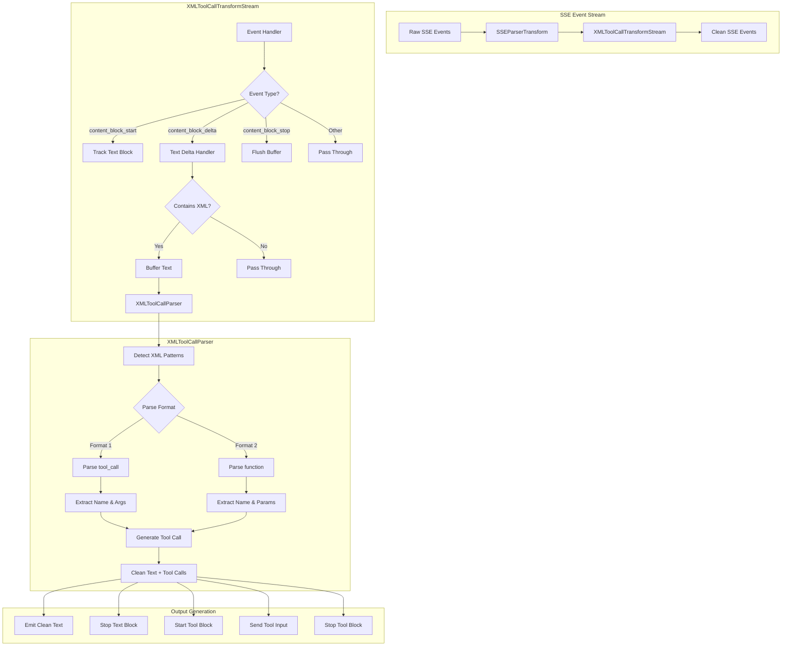
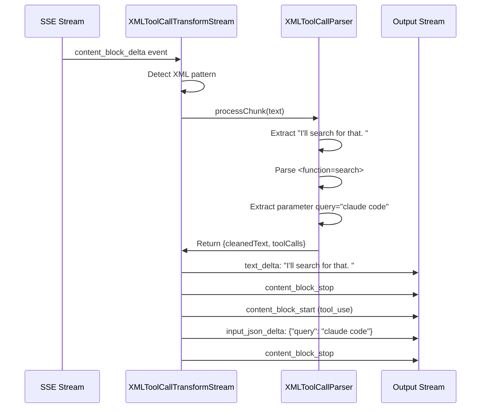
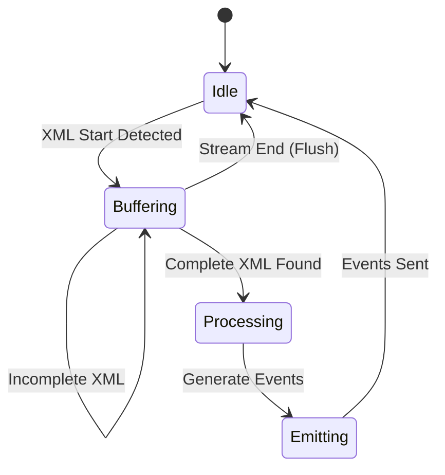

# XML Tool Call Parsing Architecture

## Overview

The XML parsing system transforms malformed XML-style tool calls from vLLM into proper Anthropic API JSON format. This document explains the architecture and data flow.

## Supported XML Formats

The parser handles two main XML formats:

### Format 1: `<tool_call>` Style
```xml
<tool_call>
  <tool_name>search</tool_name>
  <tool_arguments>{"query": "test"}</tool_arguments>
</tool_call>
```

### Format 2: `<function>` Style
```xml
<function=search>
<parameter=query>test
<parameter=limit>10
</function>
```

## Architecture Diagram



## Data Flow Example

### Input: Mixed Content with XML Tool Call

```json
{
  "event": "content_block_delta",
  "data": {
    "delta": {
      "type": "text_delta",
      "text": "I'll search for that. <function=search>\n<parameter=query>claude code\n</function>"
    }
  }
}
```

### Processing Steps



### Output: Clean Events

```json
[
  {
    "event": "content_block_delta",
    "data": {
      "delta": {
        "type": "text_delta",
        "text": "I'll search for that. "
      }
    }
  },
  {
    "event": "content_block_stop",
    "data": { "index": 0 }
  },
  {
    "event": "content_block_start",
    "data": {
      "index": 1,
      "content_block": {
        "type": "tool_use",
        "id": "toolu_1234567890_0",
        "name": "search",
        "input": {}
      }
    }
  },
  {
    "event": "content_block_delta",
    "data": {
      "index": 1,
      "delta": {
        "type": "input_json_delta",
        "partial_json": "{\"query\":\"claude code\"}"
      }
    }
  },
  {
    "event": "content_block_stop",
    "data": { "index": 1 }
  }
]
```

## Key Components

### XMLToolCallTransformStream

- **Location**: `src/utils/XMLToolCallTransform.stream.ts`
- **Purpose**: Intercepts SSE events and transforms XML tool calls
- **Features**:
  - Maintains streaming order
  - Preserves content indices
  - Handles partial XML across chunks
  - Emits proper event sequences

### XMLToolCallParser

- **Location**: `src/utils/XMLToolCallParser.ts`
- **Purpose**: Core XML parsing logic
- **Features**:
  - Supports multiple XML formats
  - Handles CDATA sections
  - Decodes XML entities
  - Manages nested XML
  - Buffers incomplete XML

## Streaming Behavior

The parser handles streaming chunks intelligently:



## Error Handling

The parser gracefully handles:

1. **Malformed XML**: Passes through as regular text
2. **Incomplete XML**: Buffers until complete or stream ends
3. **Unknown formats**: Ignores and passes through
4. **Parse failures**: Logs warning, treats as text

## Integration Points

The transform stream integrates at two key points in `src/index.ts`:

1. **Main request responses** (line ~200)
2. **Recursive agent calls** (line ~298)

```typescript
const eventStream = payload
  .pipeThrough(new SSEParserTransform())      // Parse SSE
  .pipeThrough(new XMLToolCallTransformStream()) // Transform XML
```

## Testing

Tests validate:
- XML detection and parsing
- Streaming behavior with partial chunks
- Multiple tool calls in sequence
- Mixed text and XML content
- Error recovery

Test files:
- `src/utils/__tests__/XMLToolCallParser.spec.ts`
- `src/utils/__tests__/XMLToolCallTransform.integration.test.ts`

## Performance Considerations

- **Buffering**: Minimal - only buffers incomplete XML
- **Parsing**: Fast XML parser with streaming support
- **Memory**: O(n) where n is size of largest tool call
- **Latency**: Near-zero for non-XML content